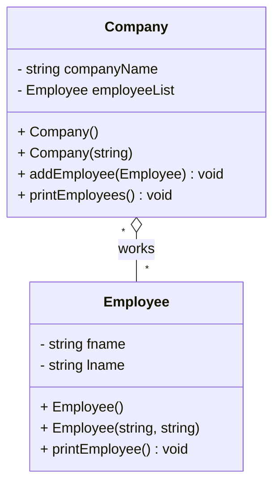

# H4 Agregaatio tehtävän luokkadiagrammi

```mermaid
classDiagram
	class Employee{
		- string fname
		- string lname
		+ Employee()
		+ Employee( string, string)
		+ printEmployee() void
	}
	class Company{
		- string companyName
		- Employee employeeList
		+ Company()
		+ Company(string)
		+ addEmployee(Employee) void
		+ printEmployees() void
	}

	Company "*" o-- "*" Employee : works
	
	
	
```