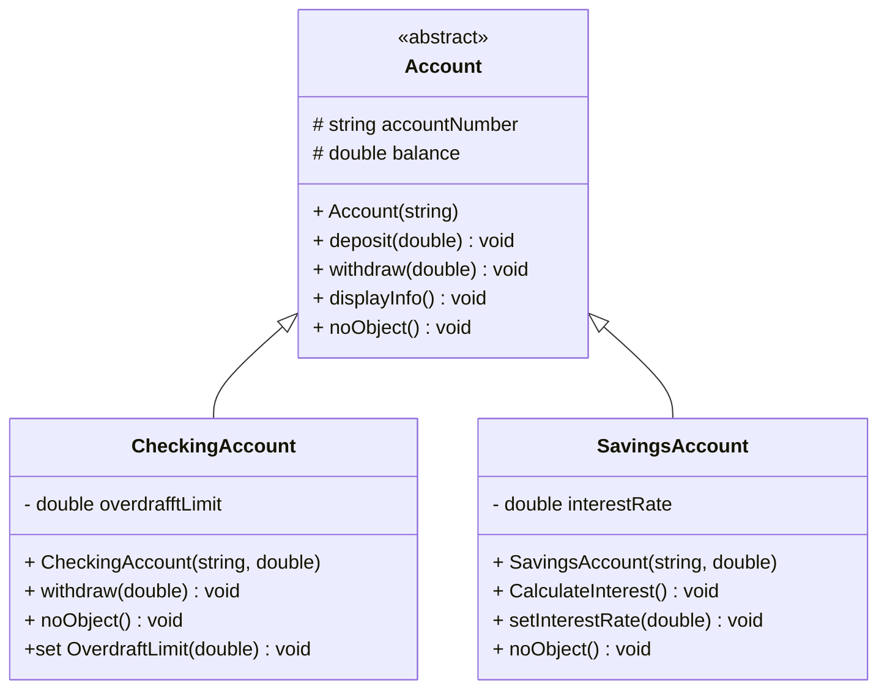

# H3T3 luokkakaavio

```mermaid
classDiagram
	class Account {
		<<abstract>>
		# string accountNumber
        # double balance
        + Account(string)
		+ deposit(double) void
		+ withdraw(double) void
		+ displayInfo() void
		+ noObject() void			
	}
	class CheckingAccount{
        - double overdrafftLimit
		+ CheckingAccount(string, double)
		+ withdraw(double) void
		+ noObject() void
		+set OverdraftLimit(double) void
	}
	class SavingsAccount{
		- double interestRate
		+ SavingsAccount(string, double)
		+ CalculateInterest() void
        + setInterestRate(double) void
        + noObject() void

	}
	Account <|-- CheckingAccount
	Account <|-- SavingsAccount
```