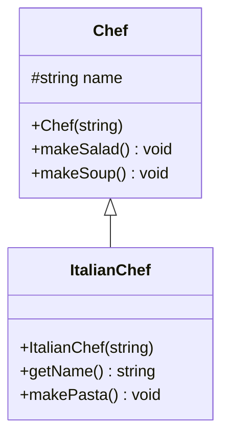

# Tehtävän H3a luokkakaavio

```mermaid
classDiagram
    class Chef {
		#string name
        +Chef(string)
		+makeSalad() void
        +makeSoup() void
	}
	class ItalianChef{
        +ItalianChef(string)
		+getName() string
        +makePasta() void
	}
	Chef <|-- ItalianChef
```